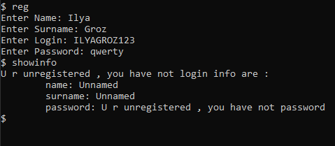
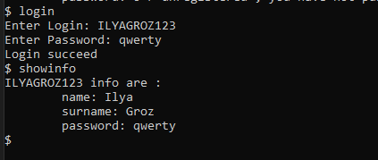
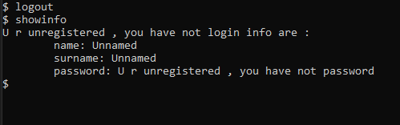

## Лабораторна робота № 1-3
### Виконання системы авторизації та реєстрації користувачів в системі в стилі ООП

В якості іммітації бази даних було використано xml файл.

Список команд

Процес реэстрації

Вхід в систему

Вихід з системи

Спроба реэстрації з вже існуючим логіном

